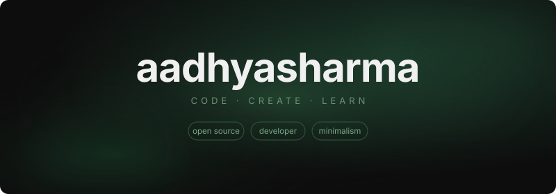
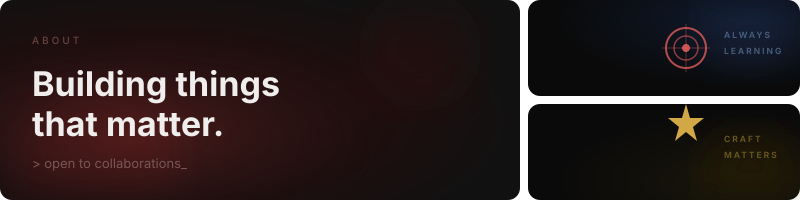
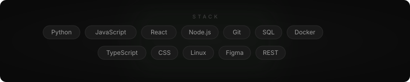

 

 

 

 

<!-- PROJECTS -->

| Project | Stats | What I built |
|---|---|---|
| ⚖️ **[Lawyers in Gurgaon](https://github.com/aadhyasharma)** | 646K impressions · 24K clicks · 18K users | Legal consultation platform on AWS Lightsail with full DevOps, SSL, and technical SEO |
| 🏠 **[eRegistry Haryana](https://github.com/aadhyasharma)** | 560K impressions · 13K clicks · 11K users | Digital property registry platform with structured SEO and WordPress infrastructure |
| ✈️ **[Snippix](https://github.com/aadhyasharma)** | Travel collages app | Full-stack travel storytelling with user auth, content flows, and responsive UI |
| 🎓 **[Soclique](https://github.com/aadhyasharma)** | Student hub | React-based college society platform for event discovery and management |

 

